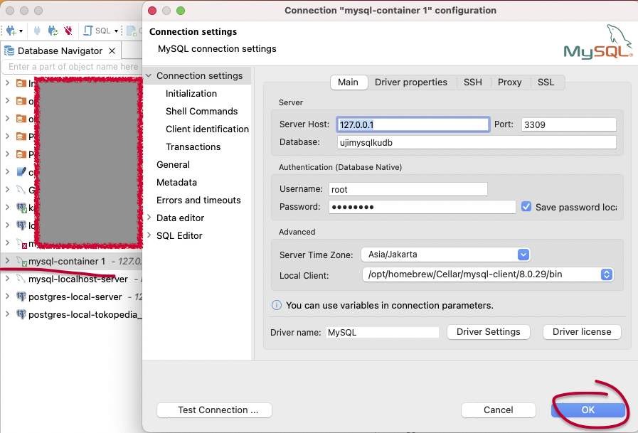

# create container mysql dengan docker-compose

	❯ docker-compose up -d

 # check:
	❯ docker images
 
		REPOSITORY   TAG       IMAGE ID       CREATED       SIZE
		mysql        latest    e68e2614955c   4 weeks ago   638MB
	
	❯ docker ps -a
 
		CONTAINER ID   IMAGE          STATUS        PORTS                               NAMES
		f8353e033885   mysql:latest   Up 13 hours   33060/tcp, 0.0.0.0:3309->3306/tcp   001-docker-compose-mysql-standard-db-1

---

    

DBeaver connection properties

---
